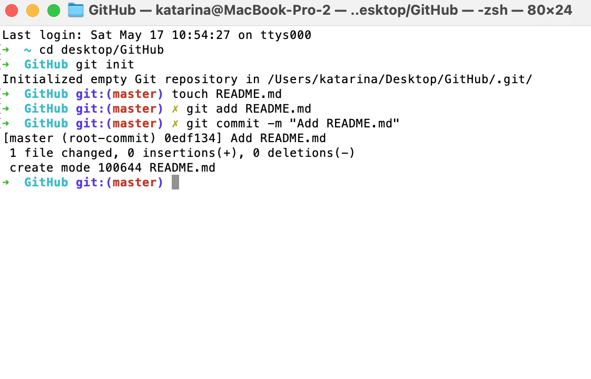
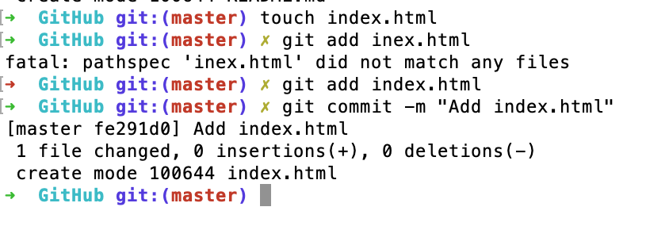
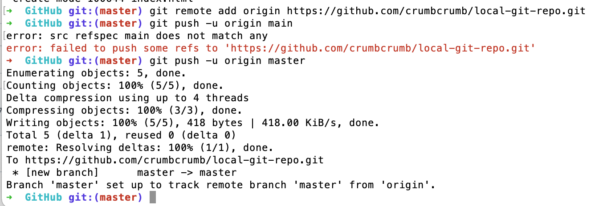
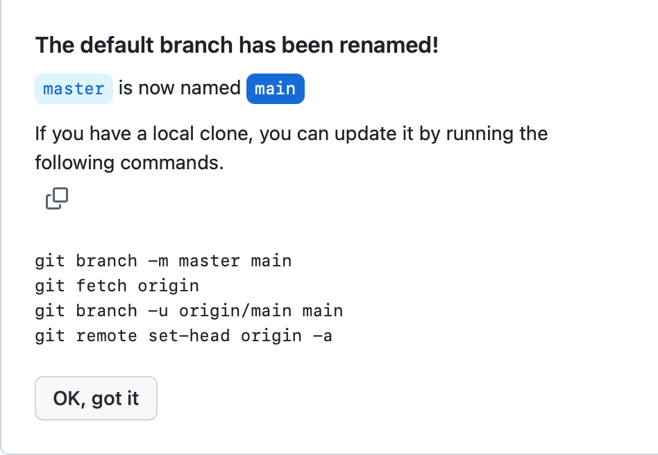
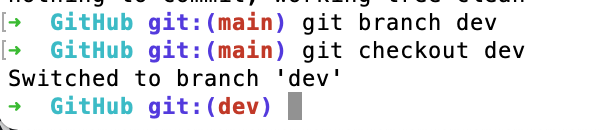
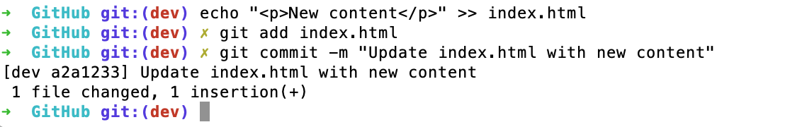
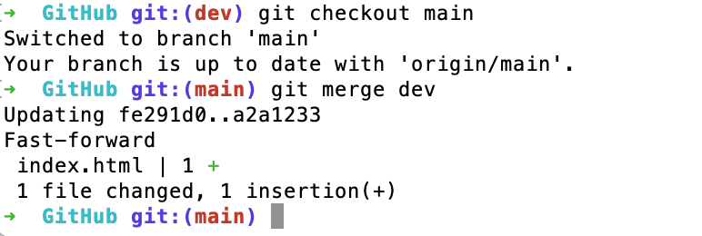
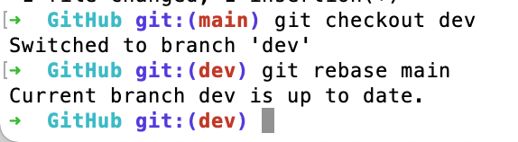

# Day 2 Assignment: Setting Up a Local Git Repository

## Part 1: Initializing a Local Git Repository

## Part 2: Adding and Committing Changes

## Part 3: Connecting to GitHub and Pushing Changes

## Part 4: Working with Branches

## Part 5: Merging vs. Rebasing

